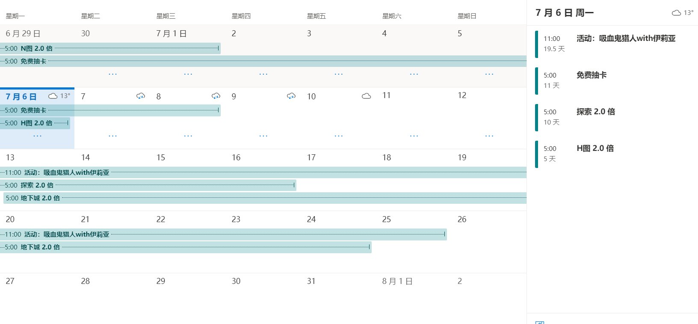
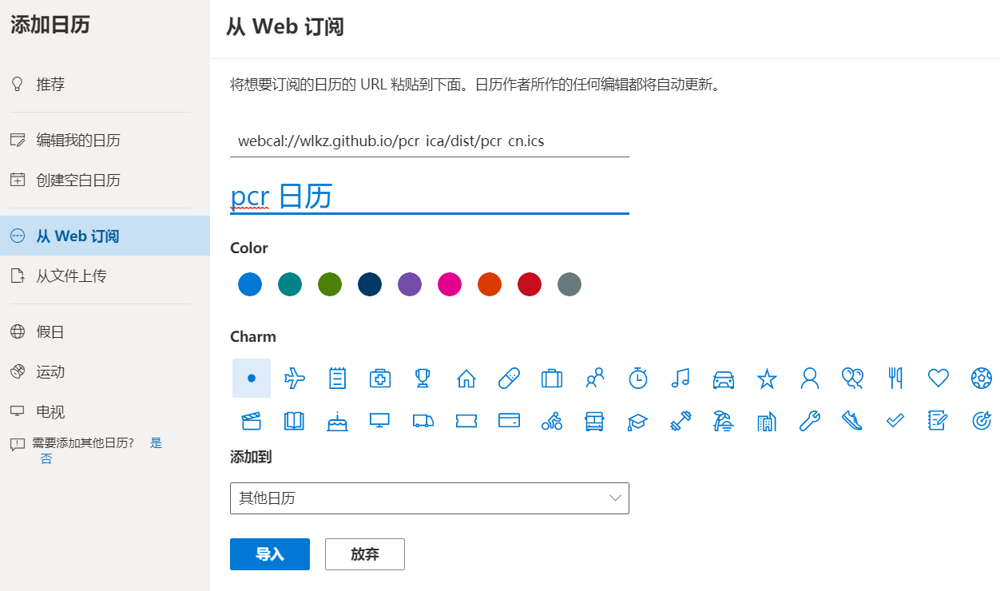

# pcr_ics

一个根据[干炸里脊资源站](https://redive.estertion.win)数据制作的公主连接活动 iCalendar 日程表。

发布地址：[webcal://wlkz.github.io/pcr_ics/dist/pcr_cn.ics](webcal://wlkz.github.io/pcr_ics/dist/pcr_cn.ics)

## 使用方法

由于当前常用日历客户端很多，在此不能一一覆盖。如果没有提到你所用的客户端，你可以以`你的客户端名 ics 在线日历导入`为关键字去查找相关方法。

此外，不推荐直接使用 ics 导入。这样会在后续更新的时候，需要手动再次导入。

另外，限于各大客户端同步实现细节不同，日历的更新以及同步可能需要大于 1 天的时间。

### iOS 用户
  
直接点击 [webcal://wlkz.github.io/pcr_ics/dist/pcr_cn.ics](webcal://wlkz.github.io/pcr_ics/dist/pcr_cn.ics) 即可。

### Outlook 用户

登录 Outlook 网页版，找到日历选项，点击添加日历，如上图输入相关信息即可。

设置完毕后，在各大支持 Exchange 服务的客户端登录，应该就能各端同步了。

## 在本地生成 ics 文件

因为还在测试期，将稍后添加更多信息。

## 将来的更新计划

- 提供日服时间表
- 为代码提供命令行接口
- 自动化抓取更新
- 相关文档更新

## 感谢

- [干炸里脊资源站](https://redive.estertion.win)
- [@yuudi](https://github.com/yuudi) 的 [
pcr-calender](https://github.com/yuudi/pcr-calender)，这个项目基本就是参考了这个项目的相关代码，再过度封装而成。另外如果同步日历麻烦，可以用他的[网页版日历](https://tools.yobot.win/calender/#cn)。

非常感谢以上大佬，如果没有他们就没有这个项目。

## 许可证

MIT License
